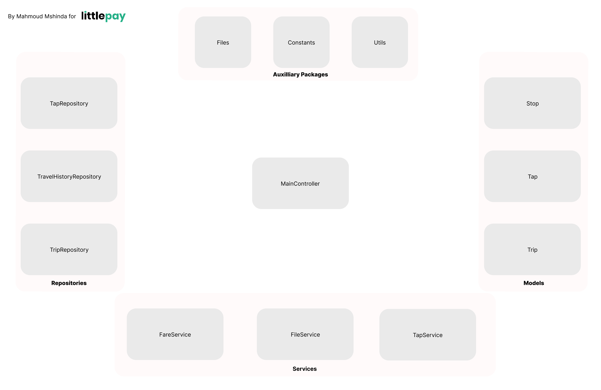
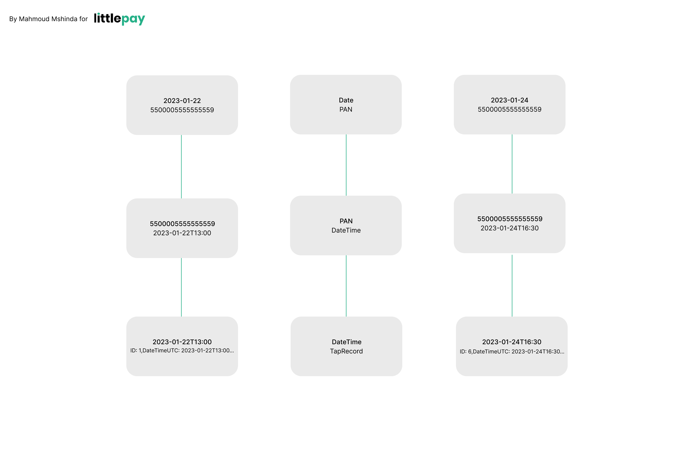
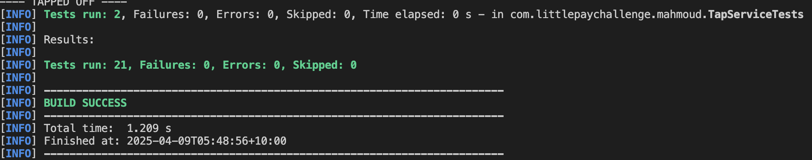

**Littlepay Coding Challenge Documentation**

**The Problem**  
The challenge requires the creation of a program that's able to read a csv file containing card taps performed on a public transport service. Each line of the file represents a card tap in the following format:

ID, DateTimeUTC, TapType, StopId, CompanyId, BusID, PAN  
1, 22-01-2023 13:00:00, ON, Stop1, Company1, Bus37, 5500005555555559

This repository contains a java maven project that reads a file of these taps, parses it and generates an output file containing the charges of the taps in a format similar to that of the provided sample output:

Started, Finished, DurationSecs, FromStopId, ToStopId, ChargeAmount, CompanyId, BusID, PAN,Status  
22-01-2018 13:00:00, 22-01-2018 13:05:00, 900, Stop1, Stop2, $3.25, Company1,Bus37, 5500005555555559,COMPLETE

**TL;DR**  
Before I get into the details of the implementation, you’re probably reading this to figure out how to run the project so I’ll get that out of the way first:

* Clone the repository ([https://github.com/mahmoudhassanjr/lp-coding-challenge-mahmoud](https://github.com/mahmoudhassanjr/lp-coding-challenge-mahmoud))  
* At the root of the directory, run mvn clean package which will execute the tests and create a .jar output  
* Run java \-jar target/tapprocessor-littlepaychallenge-mahmoud.jar  
* The program will read the stored **taps.csv** file, process it, and create an **output.csv** containing the charge amounts, etc. The final output on the console will be the contents of the file that also exist in **output.csv.** The path of the output file is **/src/main/resources/files/output/output.csv**  
* The program was built on **Maven 4.0.0** and **Java version 23**. The rest of the dependencies and their respective version numbers can be found in the **pom.xml** file.

**Assumptions**  
Throughout the task, a lot of assumptions were made—partially due to the specification naturally not getting into every corner case (e.g., how do we display the missing attributes of an incomplete trip in the output file?).

 Here are some assumptions that I made:

* The input file will always be correctly formatted as mentioned in the challenge specification (although my tests to account for some of this)  
* The input file will always be in ascending order of the DateTimeUTC column (e.g. 22-01-2025 13:00:00 will always come before any taps from 23-01-2025 13:00:00)  
* An ‘OFF’ tap will always be preceded by an ‘ON’ tap for the same customer. As in, OFF \-\> OFF and OFF \-\> ON transitions (on the same day for the latter)  should not be possible.    
* Somewhat similar to the Myki system here in Victoria, I also assume once a trip is complete, the cap for that day would’ve been reached hence other taps are not counted as part of the charge amount.   
* The solution only takes the 3 stops and their respective fares into account  
* I also assume that 2 taps from the same PAN can’t occur at the exact time (at the millisecond level)

**Solution Approach**  
Here’s an overview of the main components that make up the program.  

Due to the constraints of time, I did not have the time to architect the ideal system so there are a few areas where conventions are a bit circumvented and compromises made. However, I did try to separate and simplify things. 

The **MainController** acts as the central dispatching point that’s instantiated by the build. It first reads from the input file and orchestrates communication with the other components to process each tap. 

The **Services** handle the tapping, IO, and fare calculation functions. The **Models** act as data-representation objects for **Trips**, **Taps**, and **Stops.** The Repositories act as the primary locations to hold **Trip**, **Tap**, and **Travel History** information. **TravelHistoryRepository** holds information about the taps that were made on that date. The collection of these taps allows for the updating of trip information by the TravelHistoryRepository every time a new tap is read. Though useful, I do think that this particular component is doing too much and could be split up into more modular chunks.  

 
A lot of the code uses TreeMaps for the insertion and retrieval of tap information. This allows us to efficiently build up a performant solution due to the **O(log n)** insertions and retrievals. Though there are still many opportunities for more speedups due to the occasional re-reading of data, I attempted to build up more information through only a few passes of the data. The tradeoff here was some of the code ended up being more convoluted than I would’ve liked but there’s always an opportunity to improve things further.

**Tests**  
The repository also includes a collection of tests that cover the majority of functions. One area of improvement here is that I should have gone deeper into the repository tests but time didn’t allow for it this time, unfortunately.  
The tests can be run using mvn test**.** 

 

**Areas of Improvement**

Considering the tough time constraints, there’s definitely a lot to improve upon.

* I need to clean up the code. There’s a lot of code in this repository that I’m a bit embarrassed to submit as it was done through a stream of consciousness first pass at a solution so nowhere near enough time went into deeply fine-tuning aspects such as readability, extensibility, and single-responsibility.   
* The repository is probably quite brittle at this point. Judicious use of exception handling is not present so there’s almost certainly paths to breakage that haven’t been covered by my tests and analysis.  
* Some code should be refactored to achieve conciseness, low coupling and high cohesion (e.g. TravelHistoryRepository).

**Thank you\!**